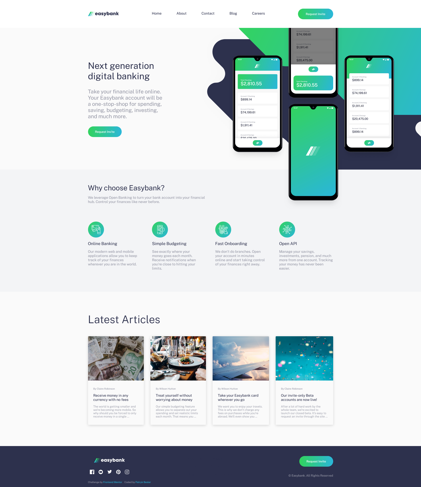

# Frontend Mentor - Easybank landing page solution

This is a solution to the [Easybank landing page challenge on Frontend Mentor](https://www.frontendmentor.io/challenges/easybank-landing-page-WaUhkoDN). Frontend Mentor challenges help you improve your coding skills by building realistic projects.

## Table of contents

-   [Overview](#overview)
    -   [The challenge](#the-challenge)
    -   [Screenshot](#screenshot)
    -   [Links](#links)
-   [My process](#my-process)
    -   [Built with](#built-with)
    -   [What I learned](#what-i-learned)
    -   [Continued development](#continued-development)
    -   [Useful resources](#useful-resources)
-   [Author](#author)
-   [Acknowledgments](#acknowledgments)

## Overview

### The challenge

Users should be able to:

-   View the optimal layout for the page depending on their device's screen size
-   See hover states for all interactive elements on the page

### Screenshot

### Links

-   [Solution Page](https://www.frontendmentor.io/solutions/)
-   [Live Site](https://beslerpatryk.github.io/easybank-landing-page/)

## My process

### Built with

-   Semantic HTML5 markup
-   CSS custom properties
-   Flexbox
-   CSS Grid
-   Mobile-first workflow

### What I learned

I didn't learn anything particularly new through doing this challenge but it solidified my knowledge and overall was a very good practice.

### Continued development

Looking forward to finally challenge myself and tackle more complicated projects 💪

## Author

-   Frontend Mentor - [@beslerpatryk](https://www.frontendmentor.io/profile/beslerpatryk)
-   Github - [@beslerpatryk](https://github.com/beslerpatryk)
